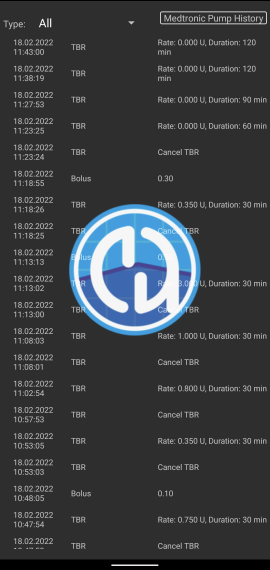

# Medtronic Pumps

***

The Medtronic pump driver only works with older pump models.  The driver does not work with newer models such as the 640G, 670G or 780G.

The following model and firmware combinations are compatible:

    - 512/712 (any firmware version)
    - 515/715 (any firmware version)
    - 522/722 (any firmware version)
    - 523/723 (firmware 2.4A or lower)
    - 554/754 EU release (firmware 2.6A or lower)
    - 554/754 Canada release (firmware 2.7A or lower)

You can find out how to check the firmware on the pumps at [OpenAPS docs](https://openaps.readthedocs.io/en/latest/docs/Gear%20Up/pump.html#how-to-check-pump-firmware-check-for-absence-of-pc-connect) or [LoopDocs](https://loopkit.github.io/loopdocs/build/step3/#medtronic-pump-firmware).

***
QUESTION - IS THIS STILL NEEDED?
If you started using Medtronic driver please add yourself to this [list](https://docs.google.com/spreadsheets/d/16XIjviXe8b-12PrB6brGubNFuAEsFZr10pjLt_SpSFQ/edit#gid=0). This is just so that we can see which Phones are good and which are not so good (or bad) for this driver. There is one column called "BT restart". This is to check if yourPhone supports BT enable/disable, which can be used when pump is no longer able to connect, that happens from time to time. If you notice any other problem, please write that in Comments column.

***

## Hardware and software requirements
- **Phone:** The Medtronic driver should work with any android phone that supports Bluetooth connections. **IMPORTANT: Phone manufacturers Bluetooth implementations can vary so how each phone model behaves can vary.  For example, some phones will handle enabling/disabling Bluetooth differently.  This can impact the user experience when AAPS needs to reconnect to your Rileylink type device.**
- **RileyLink Compatible Device:** Android phones cannot communicate to Medtronic pumps without a seperate device to handle communications. This device will link with your phone via Bluetooth and with your pump via a compatible radio connection.  The first such devlice was called a Rileylink but a number of other options are now available which can offer additional functionality.

    - Rileylink available at [getrileylink.org](https://getrileylink.org/product/rileylink916)
    - Orangelink available at [getrileylink.org](https://getrileylink.org/product/orangelink)
    - Emalink (multiple model options) available at [github.com](https://github.com/sks01/EmaLink)

A comparision chart for the various Rileylink compatible devices can be found at [getrileylink.org](https://getrileylink.org/rileylink-compatible-hardware-comparison-chart?fbclid=IwAR2vHbOzla-zmM-cSp4NkOB_23k3spgnaYvCIGRcACcIQ25FJAU_7HRkH2A)

QUESTION - KEEP GNARL?

## Configuration of the pump
The following settings should be configured on the pump in order for AAPS to remotely send commands.  The steps necessary to make each change on a Medtronic 715 are shown in brackets for each setting.  The exact steps may vary based on pump type and/or firmware version.

- **Enable remote mode on Pump** (On the pump press Act and go to Utilities -> Remote Options, Select On, and on next screen do Add ID and add any random id such as  111111). At least one ID must be on the Remote ID list in order for the pump to expect remote communication.
- **Set Max Basal** (On the pump press Act and got to Basal and then select Max Basal Rate) As an example setting this value to four times your maximum standard basal rate would allow a 400% Temporary Basal Rate. The maximum value permitted by the pump is 34.9 units per hour.
- **Set Max Bolus** (On the pump press Act and to to Bolus and then select Max Bolus) This is the largest bolus that the pump will accept.  The maximum value permitted by the pump is 25.
- **Set profile to Standard**. (On the pump press Act and go to Basal and then Select Patterns) The pump will only need one profile as AAPS will manage different profiles on your phone.  No other patterns are required.
- **Set Temporary Basal Rate type** (On the pump press Act and go to Basal and then Temp Basal Type).  Select Absolute (not Percent).
 

## Medtronic Configuration of Phone/AndroidAPS
- **Do not pair RileyLink compatible device with the Bluetooth menu on your phone.** Pairing via the Bluetooth menu on your phone will stop AndroidAPS from seeing your Rileylink Compatible device when you follow the instructions below. 
- Disable automatic screen rotation on your phone.  On certain devices automatic screen rotation causes Bluetooth sessions to restart which would cause issues for your Medtronic pump. 
- There are two ways to configure your Medtronic pump in AndroidAPS: 
1. Using the setup wizard as part of a fresh install
2. By selecting the cog icon beside the Medtronic selection in the pump selection option in Config Builder

When configuring your Medtronic pump with the setup wizard it is possible that you will be prevented from completing setup because of Bluetooth issues (e.g. you cannot succesfully connect to the pump).  Should this happen you should select the virtual pump option in order to complete the configuration and allow for further troubleshooting by using option 2.  

You need to set following items: (see picture above)
- **Pump Serial Number**: Displayed on the back of your pump and starts with SN. You should only enter the 6 numbers shown without any alpabetic characters (e.g. 123456).
- **Pump Type**: The model pump you are using (e.g. 522). 
- **Pump Frequency**: There are two options based on where your pump was originally distributed.  Please check the FAQ if you are unsure which option to select  [FAQ](../Configuration/MedtronicPump#faq)):
    - for US & Canada, frequency used is 916 Mhz
    - for Worldwide, frequency used is 868 Mhz
- **Max Bolus on Pump (U)** (in an hour): This needs to match the setting set on your pump (see Configuration of the pump above).  This setting should be carefully considered as it determines how large a bolus AndroidAPS can ever set.
- **Max Basal on Pump (U/h)**: This needs to match the setting set on your pump (see Configuration of the pump above).  Again this setting must be carefully selected as it will determine how much AndroidAPS can deliver via your basal rate.  This will effectively set the maximum temporary basal rate.  As an example setting this value to four times your maximum standard basal rate would allow a 400% Temporary Basal Rate. The maximum value permitted by the pump is 34.9 units per hour.
- **Delay before Bolus is started (s)**: This is delay before bolus is sent to pump, so that if you change your mind you can cancel it. Canceling bolus when bolus is running is not supported by pump (if you want to stop bolus when running, you have to suspend pump and then resume).
- **Medtronic Encoding**: This is setting which determines, if 4b6b encoding that Medtronic devices do will be done in AndroidAPS or on RileyLink. If you have a RileyLink with 2.x firmware, default value will be to use Hardware encoding (= done by RileyLink), if you have 0.x firmware this setting will be ignored.
- **Battery Type (Power View)**: If you want to see battery power in your pump, you need to select type of battery you use (currently supported Lithium or Alkaline), this will in turn change display to display calculated percent and volts.
- **RileyLink Configuration**: This will find your RileyLink/GNARL device.
- **Set neutral temp basals** is an option which can help prevent Medtronic pumps from beeping on the hour. If enabled if will cancel a temp basal before the hour end to prevent this from happening.

## MEDTRONIC (MDT) Tab

On pump tab you can see several lines that are showing pumps (and connections) current status.
- **RileyLink Status**: It shows status of RileyLink connection. Phone should be connected to RileyLink all the time.
- **Pump Status**: Status of pump connection, this can have several values, but mostly we will see sleep icon (when pump connection is not active), when command is beeing executed, we might see "Waking Up", which is AAPS trying to make connection to your pump or description of any command that might be running on pump (ex.: Get Time, Set TBR, etc.).
- **Battery**: Shows battery status depening on your configuration. This can be simple icon showing if battery is empty or full (red if battery is getting critical, under 20%), or percent and voltage.
- **Last connection**: Time when last connection to pump was successful.
- **Last Bolus**: When last bolus was given.
- **Base Basal Rate**: This is the base basal rate that runs on pump at this hour.
- **Temp basal**: Temp basal that is running or empty.
- **Reservoir**: How much insulin is in reservoir (updated at least every hour).
- **Errors**: Error string if there is problem (mostly shows if there is error in configuration).

On lower end we have 3 buttons:
- **Refresh** is for refreshing state. This should be used only after connection was not present for long time, as this action will reset data about pump (retrieve history, get/set time, get profile, get battery status, etc).
- **Pump History**: Shows pump history (see [bellow](../Configuration/MedtronicPump#pump-history))
- **RL Stats**: Show RL Stats (see [bellow](../Configuration/MedtronicPump#rl-status-rileylink-status))

## Pump History

Pump history is retrieved every 5 minutes and stored localy. We keep history only for last 24 hours, so older entries are removed when new are added. This is simple way to see the pump history (some entries from pump might not be displayed, because they are not relevant - for example configuration of functions that are not used by AndroidAPS).

## RL Status (RileyLink Status)

Dialog has two tabs:
- **Settings**: Shows settings about RileyLink: Configured Address, Connected Device, Connection Status, Connection Error and RileyLink Firmware versions. Device Type is always Medtronic Pump, Model would be your model, Serial number is configured serial number, Pump Frequency shows which frequency you use, Last Frequency is last frequency used.
- **History**: Shows communication history, items with RileyLink shows state changes for RileyLink and Medtronic shows which commands were sent to pump.

## Actions
When Medtronic driver is selected, 3 possible actions can be added to Actions Tab:
- **Wake and Tune Up** - If you see that your AndroidAPS hasn't contacted your pump in a while (it should contact it every 5 minutes), you can force Tune Up. This will try to contact your pump, by searching all sub frequencies on which Pump can be contacted. If it finds one it will set it as your default frequency. 
- **Reset RileyLink Config** - If you reset your RileyLink/GNARL, you need to use this action, so that device can be reconfigured (frequency set, frequency type set, encoding configured).
- **Clear Bolus Block** - When you start bolus, we set Bolus Block, which prevents any commands to be issued to pump. If you suspend your pump and resume (to cancel bolus), you can then remove that block. Option is only there when bolus is running...  

## Important notes

### OpenAPS users
When you start using AndroidAPS, primary controller is AndroidAPS and all commands should go through it. Sending boluses should go through AAPS and not be done on pump. We have code in place that will detect any command done on pump, but if you can you should avoid it (I think we fixed all the problems with pump history and AAPS history synchronization, but small issues still may arrise, especially if you use the "setup" as it was not intended to be used). Since I started using AndroidAPS with my pump, I haven't touched the pump, except when I have to change the reservoir, and this is the way that AndroidAPS should be used. 

### Logging
Since Medtronic driver is very new, you need to enable logging, so that we can debug and fix problems, if they should arise. Click on icon on upper left corner, select Maintainance and Log Settings. Options Pump, PumpComm, PumpBTComm need to be checked.

### RileyLink/GNARL
When you restart RileyLink or GNARL, you need to either do new TuneUp (action "Wake and Tune Up") or resend communication parameters (action "Reset RileyLink Config"), or else communication will fail.

### CGMS
Medtronic CGMS is currently NOT supported.

### Manual use of pump
You should avoid manually doing treatments things on your pump. All commands (bolus, TBR) should go through AndroidAPS, but if it happens that you will do manual commands, do NOT run commands with frequency less than 3 minutes (so if you do 2 boluses (for whatever reason), second should be started at least 3 minutes after first one).

## Timezone changes and DST (Daylight Saving Time) or Traveling with Medtronic Pump and AndroidAPS

Important thing to remember is that you should never disable loop when you are traveling (unless your CGMS can't do offline mode). AAPS will automatically detect Timezone changes and will send command to Pump to change time, when time on Phone is changed. 

Now if you travel to East and your TZ changes with adding hours (ex. from GMT+0 to GMT+2), pump history won't have problem and you don't have to worry... but if you travel to West and your TZ changes by removing hours (GMT+2 to GMT-0), then sychronization might be little iffy. In clear text, that means that for next x hours you will have to be careful, because your IOB, might be little weird. 

We are aware of this problem, and we are already looking into possible solution (see https://github.com/andyrozman/RileyLinkAAPS/issues/145), but for now, have that info in mind when traveling.

## FAQ

### Can I see the power of RileyLink/GNARL?
No. At the moment none of this devices support this and it probably won't even in the future.

### Is GNARL full replacement for RileyLink?
Yes. Author of GNARL added all functions used by Medtronic driver. All Medtronic communication is supported (at time of the writing (June/2019). GNARL can't be used for Omnipod communication. Downside of GNARL is that you have to build it yourself, and you have to have compatible version of hardware.

**Note from author:** Please note that the GNARL software is still experimental and lightly tested, and should not be considered as safe to use as a RileyLink.

### Where can I get RileyLink or GNARL?
Like mentioned before you can get devices here:
- RileyLink - You can get device here - [getrileylink.org](https://getrileylink.org/).
- GNARL - You can get info here, but device needs to be ordered elsewhere ([github.com/ecc1/gnarl](https://github.com/ecc1/gnarl)).

### What to do if I loose connection to RileyLink and/or pump?
1. Run "Wake Up and Tune" action, this will try to find right frequency to communicate with pump.
2. Disable Bluetooth, wait 10s and enable it again. This will force reconnecting to RileyLink.
3. Reset RileyLink, after you do that do not forget to run "Reset RileyLink Config" action.
4. Try 3 and 2 together.
5. Reset RileyLink and reset phone.

### How to determine what Frequency my pump uses

If you turn your pump around in first line on right side you will see special 3 letter code. First two letters determine frequency type and last one determines color. Here are possible values for Frequency:
- NA - North America (in frequency selection you need to select "US & Canada (916 MHz)")
- CA - Canada (in frequency selection you need to select "US & Canada (916 MHz)")
- WW - Worldwide (in frequency selection you need to select "Worldwide (868 Mhz)")
